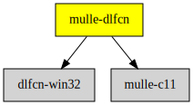

# mulle-dlfcn

#### ♿️ Shared library helper

This is an empty project that provides link instructions for consumers
of the "dlfcn" on various platforms. It also provides the
`MULLE_RTLD_DEFAULT` define, which is what one generally wants to use when
looking up symbols with `dlysm`.

On Windows this will use [dlfcn-win32]() to supply `dlsym` and relatives.

### You are here




## Add

Use [mulle-sde](//github.com/mulle-sde) to add mulle-dlfcn to your project:

``` sh
mulle-sde dependency add --c \
                         --github mulle-core \
                         --marks no-actual-link,no-singlephase \
                         mulle-dlfcn
```

## Install

### mulle-sde

Use [mulle-sde](//github.com/mulle-sde) to build and install mulle-dlfcn and all dependencies:

``` sh
mulle-sde install --prefix /usr/local \
   https://github.com/mulle-core/mulle-dlfcn/archive/latest.tar.gz
```

### Manual Installation

Install into `/usr/local`:

``` sh
cmake -B build \
      -DCMAKE_INSTALL_PREFIX=/usr/local \
      -DCMAKE_PREFIX_PATH=/usr/local \
      -DCMAKE_BUILD_TYPE=Release &&
cmake --build build --config Release &&
cmake --install build --config Release
```


